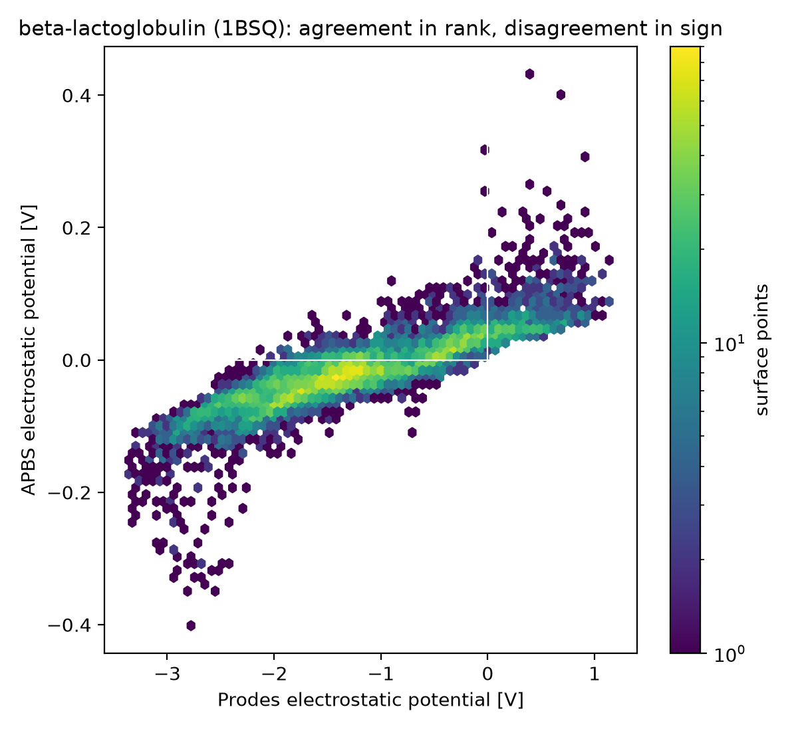
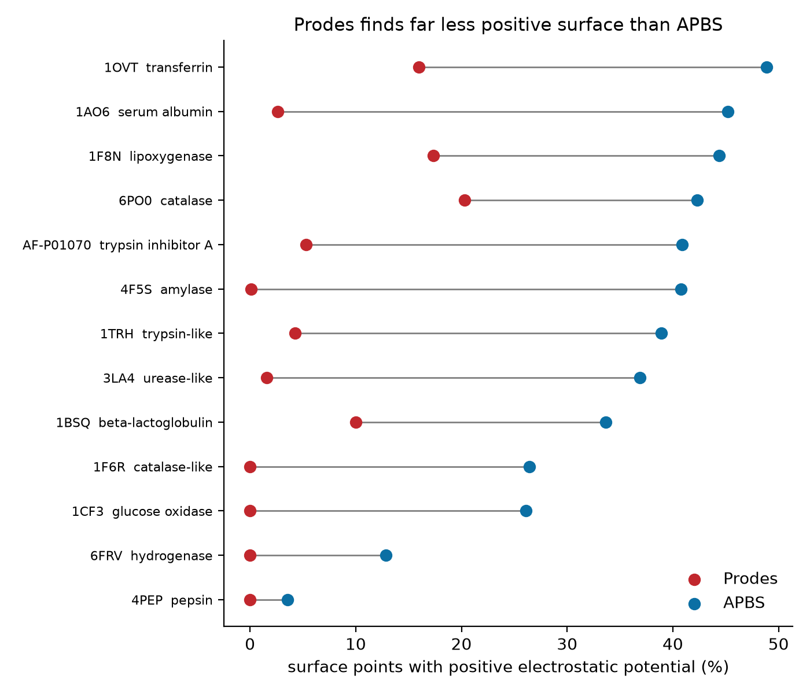
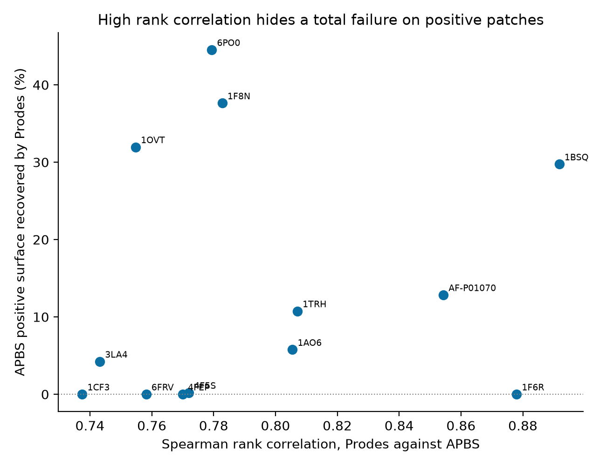
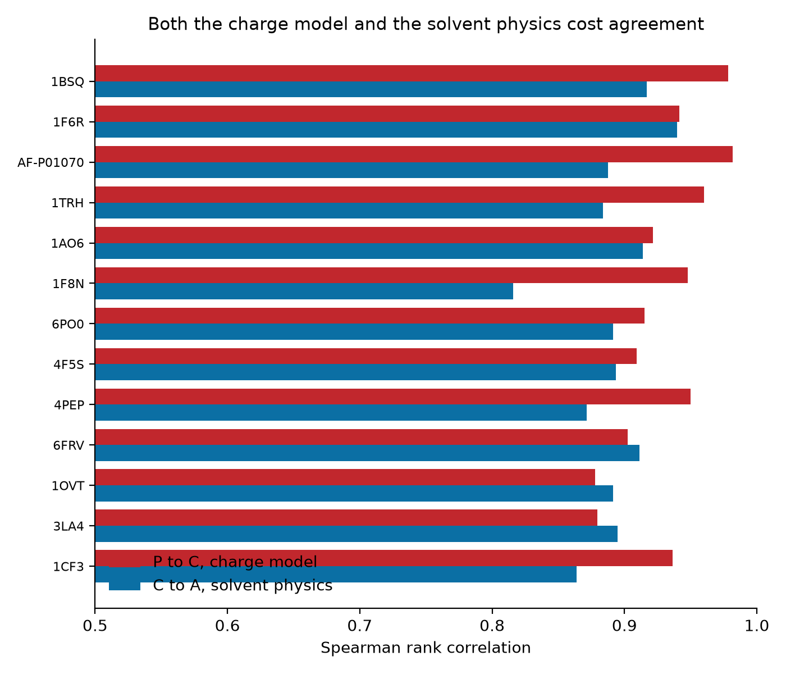

# How well does the Prodes electrostatic potential agree with APBS?

**Run date:** 2026-08-20. **Branch:** `visualisation`. **Conditions:** pH 7, 150 mM 1:1 salt, protein dielectric 4, solvent dielectric 78.54, 298.15 K. All 13 commercial proteins of Neijenhuis (2025), 390,427 surface points in total. No structure failed.

Plan: `plan_apbs_vs_prodes_comparison_REFINED.md`. Measurement: `scripts/apbs_comparison.py`. Figures: `scripts/plot_apbs_comparison.py`.

---

## The short answer

**Prodes agrees with APBS up to an affine transform. What breaks is anything defined by a threshold.**

Rank correlation with a real Poisson-Boltzmann calculation is 0.74 to 0.89, which by the usual standards is good agreement. But Prodes recovers only **17.5 %** of the surface that APBS calls positively charged, and on **four of the thirteen proteins it finds no positive surface at all** while APBS finds between 3.5 % and 26.5 %.

The failure is one-directional, and that turns out to be the useful part. When Prodes does call a point positive it is right **95.6 %** of the time. It almost never invents a positive patch; it just misses most of them.

| | value |
| --- | --- |
| Spearman rank correlation, median across 13 proteins | 0.78 (range 0.74 to 0.89) |
| Sign agreement, median | 0.72 (range 0.59 to 0.96) |
| Top decile retrieval AUC, median | 0.87 (range 0.76 to 0.96) |
| **Recall of APBS positive surface, pooled** | **17.5 %** |
| **Precision when Prodes says positive, pooled** | **95.6 %** |
| Prodes potentials larger than APBS by | 14x to 29x (median 20x) |

---

## What was compared, and why it is a fair comparison

Both methods were evaluated **at exactly the same coordinates**: the Prodes surface points themselves. That is the whole design. Comparing two rendered surfaces would have mixed up the electrostatics with the definition of "the surface", since Prodes and APBS draw different surfaces. Sampling both at identical positions removes that.

Protonation was matched rather than assumed. Both tools were driven from PROPKA at pH 7, and every structure carries a per residue charge comparison in `apbs_results/<id>/<id>_residue_charges.csv`. Six of the thirteen matched **exactly, residue for residue**; the rest differ on between 2 and 10 residues out of hundreds. Crystallographic waters were stripped from the input before either method saw the structure, which matters more than it sounds: left in, they move the Pearson correlation from 0.89 to 0.16.

## Why the signs disagree: the physics, slowly

Prodes computes Coulomb's law with a single dielectric constant of 4 everywhere and **no ions**:

```
potential = sum over all charged atoms of   q / (4 pi eps0 * 4 * d)
```

Two things are missing, and only one of them matters here.

**The missing ions are the whole story.** A real buffer is full of mobile salt ions. Around a negative patch, positive ions gather and cancel its field at a distance; around a positive patch, the reverse. Beyond roughly 8 Angstrom at 150 mM salt (the Debye length), a charge's influence is essentially gone. Prodes has no ions, so **every** charged group on the protein contributes to **every** surface point, including groups 60 Angstrom away on the far side that in a real buffer would be screened out by a factor of about 5e-4.

Most proteins in this set carry a substantial net negative charge. With no screening, all that distant negative charge adds a large, smooth, negative background to every point on the surface at once. The local pattern survives underneath it, which is why the rank correlation stays high, but the whole distribution is pushed below zero, which is why the positive patches vanish.

The scatter of individual points makes this visible directly. The relationship is tight and monotone, but the cloud crosses APBS zero at about **-0.7 V on the Prodes axis**, not at 0. Every point between -0.7 V and 0 V is genuinely positive surface that Prodes reports as negative.



**The missing solvent screening explains the magnitude, not the sign.** The surface points sit in water, where the dielectric constant is about 78, but Prodes treats them as though buried in protein at 4. That is why Prodes values run to several volts where APBS gives tenths of a volt. Measured, Prodes is 14x to 29x larger, median 20x. A naive prediction from the dielectric ratio alone, 78/4, would be about 20x, so that happens to land in the right place, but the measured factor moves with salt concentration, so screening is doing part of the work too.

## The headline figure



Every protein sits to the left of its APBS counterpart, most of them by a wide margin. Four proteins (glucose oxidase 1CF3, 1F6R, pepsin 4PEP, hydrogenase 6FRV) report a surface that is **100 % negative** under Prodes.

Glucose oxidase is the cleanest case, and it is worth noting that this is not a bug: its published Prodes figure in Neijenhuis (2025) is a uniformly dark red blob, exactly as it should be given what Prodes computes. APBS says a quarter of that surface is positive.

## Why the rank correlation does not show this



This is the methodological point worth carrying forward. Spearman correlation is invariant to **any** monotone transform of the data, and that includes adding a constant. Since the missing ionic screening acts as a large near-constant negative offset, Spearman is close to blind to precisely the effect that matters.

1F6R sits at Spearman 0.88, comfortably in "good agreement" territory, and recovers **zero per cent** of the APBS positive surface. Reporting a rank correlation alone would have produced a reassuring number and concealed the finding.

**Recommendation for any future write up: report recall of the positive surface, not just a rank correlation.**

## Where the disagreement comes from

Three models were compared to separate the two possible causes:

- **P** = Prodes: fractional formal charges on 7 residue types plus termini, Coulomb at dielectric 4
- **C** = the same Coulomb kernel on the AMBER force field charges from the PQR
- **A** = APBS: those same charges, full Poisson-Boltzmann with a dielectric boundary and salt

P to C isolates the **charge model**; C to A isolates the **solvent physics**.



| step | median Spearman | interpretation |
| --- | --- | --- |
| P to C | 0.936 | the charge model costs about 0.06 |
| C to A | 0.892 | the solvent physics costs about 0.11 |

Solvent physics costs roughly twice what the charge model does, but **the charge model is not free**, which the original plan assumed it would be. Prodes places charge on only seven residue types and puts nothing at all on backbone amides, carbonyls or hydroxyls, so a real force field's charge distribution is meaningfully different even before any solvent physics is involved.

## What this means for the machine learning

The first draft of this section led with "Prodes cannot see positive patches". That framing is wrong for machine learning, and it was corrected after pushback. **An additive offset is invariant for any monotone feature**, so a surface that is uniformly too negative costs a model nothing. On 1BSQ an affine map of the Prodes potential reproduces **73 %** of the APBS variance, and once the ramp is rescaled the two point clouds are visually near identical, patch for patch. For visualisation and for client work the missing positive patches matter; for a mean or a standard deviation they do not.

Two things do survive, and they are more specific.

### 1. The mean surface potential is net charge over radius, and almost nothing else

The unscreened Coulomb sum is dominated by its monopole term, and the monopole term is `Q/R`. Since the number of surface points scales with area, `netQ / sqrt(n_points)` is that term.

| | R2 of mean surface EP against Q/R |
| --- | --- |
| **Prodes** | **0.991** |
| APBS | 0.683 |

Remove `Q/R` and **0.9 %** of the Prodes variance remains, against **31.7 %** for APBS. The residuals correlate at r = 0.19, which at n = 13 is not distinguishable from zero.

So the Prodes mean surface potential is a proxy for two global numbers. It carries real predictive signal, because net charge genuinely drives ion exchange retention, but it carries the *same* signal a global descriptor carries and very little of the local information that is the stated reason for computing a surface at all. Any claim that surface descriptors capture what global descriptors miss needs to be tested against that, not assumed.

### 2. Threshold features are broken, and the breakage is specific to cation exchange

A threshold is the one operation an affine shift does not survive. Prodes selects its positive population with `ep > 0`, but the value at which APBS crosses zero sits between **-0.40 V and -3.68 V** depending on the protein. The cutoff is in the wrong place, and by a different amount for each protein.

Measured as set overlap between the points Prodes calls positive and the points APBS calls positive:

| | median Jaccard overlap |
| --- | --- |
| Prodes, naive `ep > 0` | **0.058** |
| Prodes, thresholded at the APBS zero crossing | 0.601 |

**0.058 means the two sets are very nearly disjoint.** On four proteins the overlap is exactly zero. Three features in the default 54-feature set are built on that population: `NSurfPosEpFormal`, `SurfEpPosFormalMean` and `SurfEpPosFormalStd`, and `standard_features` returns 0 for an empty array, so all three collapse to 0 for those four proteins while APBS counts 489 to 7,754 positive points.

The negative side is unaffected, which produces a clean asymmetry:

| feature | Spearman against the APBS equivalent, across 13 proteins | relevant to |
| --- | --- | --- |
| `NSurfNegEp` | 0.956 | anion exchange |
| `SurfEpNegMean` | 0.571 | anion exchange |
| `NSurfPosEp` | 0.641 | cation exchange |
| `SurfEpPosMean` | 0.234 | cation exchange |
| `SurfEpPosStd` | 0.123 | cation exchange |

**Anion exchange is dominated by negative surface, which Prodes describes well. Cation exchange is dominated by positive surface, which Prodes describes through a mis-placed threshold.** Any reported cation exchange retention model built on the positive-EP features deserves scrutiny on this basis, particularly one fitted to a small dataset, where collinearity with net charge would be invisible.

### The fix, which needs no APBS

The threshold is predictable from quantities Prodes already computes:

| predictor | R2 with the correct threshold |
| --- | --- |
| net charge Q | 0.923 |
| Q / sqrt(n_points) | 0.940 |
| **Prodes own mean surface EP** | **0.954** |

A single linear rule, `threshold = 0.743 * meanEP - 0.121`, has a residual of 0.21 V over a threshold range of 3.3 V, and recomputing the count feature against it gives:

| `NSurfPosEp`, Spearman against APBS | |
| --- | --- |
| naive `ep > 0` | 0.641 |
| thresholded at the true APBS zero | 0.995 |
| **thresholded at the predicted value, no APBS** | **0.973** |

That is a concrete repair to a released feature, requiring no external tool. Note that `SurfEpPosMean` is only partly repaired (0.234 to 0.335): recentring fixes which points are selected, but the mean of a censored tail remains sensitive to the scale as well.

**This rule is fitted and evaluated on the same 13 proteins and has no held-out validation.** It should be treated as a demonstration that the breakage is systematic and correctable, not as a calibration ready to ship.

### Suggested next step

Recompute the surface features from the APBS potentials and refit the retention models. If Prodes-EP and APBS-EP features predict equally well, the crude physics is vindicated for machine learning and only the figures were ever misleading. If APBS features win on cation exchange specifically, that localises the problem exactly where this analysis predicts it.

## Caveats

- **Four proteins are multi chain** (1AO6, 1F6R, 4F5S, 6PO0) and Prodes has a pKa assignment bug for those: `convert_propka` keys on residue number alone and ignores the chain, so every chain silently receives chain A's pKa. Their numbers are reported above but should be treated as weaker. Excluding them does not change the conclusion: median Spearman 0.77 and the same pattern of missing positive surface.
- **Covalently modified residues are dropped by both tools**: 3LA4 carries a carboxylated lysine and 4PEP a phosphoserine, both genuinely charged in the real protein and absent from both models. 1OVT loses two Fe3+ and two carbonate ions the same way, which is a large omission for a protein whose net charge is only -3.
- **Ligands and cofactors are handled consistently**, which is the good news. Prodes reads only `ATOM` records so it never sees a HETATM, and pdb2pqr drops all of them, so both models describe the same set of atoms.
- **Prodes uses 1.6e-19 for the elementary charge** rather than 1.602176634e-19, a 0.136 % low bias in every value it has ever produced. Irrelevant to everything above, but it should not be silently "fixed" without regenerating the published figures.
- **Only one condition was run**, pH 7 at 150 mM. A salt sweep would test the offset explanation directly and is the obvious next experiment: the prediction is that agreement on sign improves sharply as salt goes to zero.

## Reproducing

```bash
source activate prodes
python scripts/apbs_comparison.py        # about 12 minutes, needs the prodes-apbs env
python scripts/plot_apbs_comparison.py   # seconds, redraws from the committed summary
```

The three per protein figures redraw from `docs/visualisation/apbs_vs_prodes_summary.csv`, which is committed, so they are reproducible without access to this machine. The point scatter needs the per point table under `apbs_results/`, which is git ignored, and is skipped with a message if absent.

## Method

| | |
| --- | --- |
| Machine | Linux server, 16 logical CPUs, 125 GB RAM |
| Structures | `../biochai/data/08_neijenhuis/structures`, 13 proteins, one of which (AF-P01070) is an AlphaFold model |
| pKa | PROPKA via pdb2pqr at pH 7, matched per residue against the Prodes assignment |
| APBS | 3.4.1, `mg-auto`, non-linear PB (`npbe`), `bcfl sdh`, `srfm smol`, `chgm spl2` |
| pdb2pqr | 3.6.1, AMBER force field, `--keep-chain --nodebump`, waters pre-stripped from the input |
| propka | 3.5.1 |
| Environment | `environment_apbs.yml` (env `prodes-apbs`, Python 3.12) |
| Grid | fine grid spacing 0.476 to 0.556 Angstrom; every surface point verified inside the fine grid |
| Total runtime | about 12 minutes for all 13 |

Each structure's directory under `apbs_results/` holds its run record, the exact APBS input used, the tool versions and the git commit.
